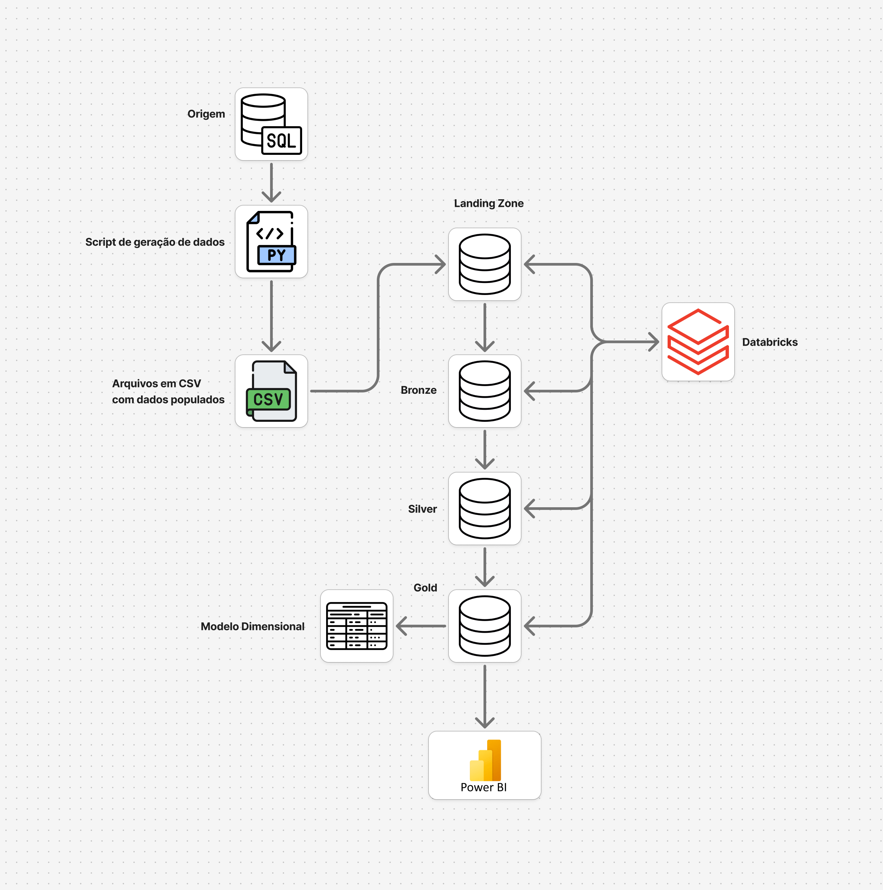

# Pipeline ETL para Dados de Clínicas Odontológicas

[](https://lugialo.github.io/ex-etl-engdados/) Este projeto acadêmico, desenvolvido para a disciplina de Engenharia de Dados da UNISATC, implementa um pipeline ETL completo para simular a ingestão, transformação e carregamento de dados de diversas fontes de um sistema de gestão de clínicas odontológicas. O objetivo é demonstrar a aplicação da arquitetura medalhão (Landing, Bronze, Silver, Gold) e preparar os dados para análise e geração de insights de negócio.

## Desenho de Arquitetura

 ## Pré-requisitos e Ferramentas Utilizadas

Para executar este projeto, você precisará de:

* **Linguagem:** Python 3.9+
* **Bibliotecas Python:** `pandas`, `faker`, `sqlalchemy`, `psycopg2-binary`, `azure-storage-blob`, `python-dotenv`, entre outras listadas em `requirements.txt`.
* **Banco de Dados:** PostgreSQL (configurável via Docker Compose)
* **Containerização:** Docker e Docker Compose
* **Infraestrutura como Código:** Terraform (para deploy na Azure)
* **Cloud Storage:** Azure Storage Account (opcional)
* **Documentação:** MkDocs

## Estrutura do Projeto

```
.
├── data/
│   ├── raw/                  # Dados brutos originais (CSV gerados)
│   └── teste/                # Dados de teste
├── docker/
│   └── docker-compose.yml    # Configuração do PostgreSQL via Docker
├── docs/                     # Arquivos fonte da documentação MkDocs
│   ├── img/                  # Imagens para a documentação (ex: arquitetura_etl.png)
│   ├── introducao/           # Documentação de introdução
│   ├── camadas/              # Documentação das camadas do Data Lake
│   ├── pipeline/             # Detalhes de cada etapa do pipeline
│   └── modelagem/            # Documentação da modelagem de dados
├── notebooks/
│   ├── notebook_landing_bronze.ipynb  # Notebook para ingestão de Landing para Bronze
│   ├── notebook_bronze_silver.ipynb   # Notebook para transformação de Bronze para Silver
│   ├── notebook_silver_gold.ipynb     # Notebook para modelagem de Silver para Gold
│   └── teste/                # Notebooks de teste
├── scripts/
│   ├── gerador_dados.py      # Script para gerar dados de teste (com suporte a Azure e DB)
│   ├── modelo_dimensional.sql # Script SQL para criar o modelo dimensional (Data Warehouse)
│   ├── modelo_fisico.sql     # Script SQL para criar o modelo físico do banco de dados
│   └── teste_db.py           # Script para testar conexão com banco
├── terraform/                # Infraestrutura como código para Azure
│   ├── main.tf               # Recursos principais (Storage, Databricks, etc.)
│   ├── variables.tf          # Variáveis do Terraform
│   └── providers.tf          # Provedores (Azure)
├── .env.example              # Exemplo de configuração de variáveis de ambiente
├── requirements.txt          # Dependências do projeto Python
├── mkdocs.yml                # Configuração do MkDocs
└── README.md                 # Este arquivo
```

## Instalação e Configuração

Siga os passos abaixo para configurar e executar o projeto em seu ambiente local:

1.  **Clone o repositório:**
    ```bash
    git clone [https://github.com/lugialo/ex-etl-engdados.git](https://github.com/lugialo/ex-etl-engdados.git)
    cd ex-etl-engdados
    ```

2.  **Configuração das Variáveis de Ambiente:**
    ```bash
    cp .env.example .env
    # Edite o arquivo .env com suas credenciais:
    # - AZURE_STORAGE_CONNECTION_STRING (se usar Azure Storage)
    # - AZURE_CONTAINER_NAME
    # - DB_HOST, DB_PORT, DB_NAME, DB_USER, DB_PASSWORD (se customizar o banco)
    ```

3.  **Opção A - Usando Docker (Recomendado):**
    ```bash
    # Subir o banco PostgreSQL via Docker
    cd docker
    docker-compose up -d
    cd ..
    ```

4.  **Opção B - Configuração Manual do Banco de Dados:**
    * Certifique-se de ter um servidor PostgreSQL rodando
    * Crie um banco de dados e usuário conforme necessário
    * Atualize as credenciais no arquivo `.env`

5.  **Crie e ative um ambiente virtual:**
    ```bash
    python -m venv venv
    source venv/bin/activate  # Linux/macOS
    # ou
    .\venv\Scripts\activate   # Windows
    ```

6.  **Instale as dependências:**
    ```bash
    pip install -r requirements.txt
    ```

### Configuração da Infraestrutura (Azure e banco local)

Para deploy na Azure, o projeto inclui configurações Terraform que criam:

- **Resource Group**: `rgdatatrabalhoed01`
- **Storage Account**: `stacdatatrabalhoed01` 
- **Storage Containers**: `landingzone`, `bronze`, `silver`, `gold`
- **Azure Databricks Workspace**: Para processamento de dados
- **Key Vault**: Para gerenciamento de secrets

**Variáveis principais:**
- `env`: Ambiente (dev, prod, etc.)
- `company`: Nome da empresa (padrão: "trabalhoed")
- `default_location`: Região Azure (padrão: "Brazil South")

### Configuração de Variáveis de Ambiente

Crie um arquivo `.env` baseado no `.env.example`:

```bash
# Configurações do Azure Storage
AZURE_STORAGE_CONNECTION_STRING=DefaultEndpointsProtocol=https;AccountName=...
AZURE_CONTAINER_NAME=landingzone

# Configurações do Banco de Dados Local
DB_HOST=localhost
DB_PORT=5432
DB_NAME=clinica_odonto
DB_USER=root
DB_PASSWORD=root
```

1.  **Configure as credenciais da Azure:**
    ```bash
    az login
    ```

2.  **Configure as variáveis no arquivo `terraform.tfvars`:**
    ```hcl
    env = "dev"
    company = "suaempresa"
    default_location = "Brazil South"
    ```

3.  **Inicialize e aplique o Terraform:**
    ```bash
    cd terraform
    terraform init
    terraform plan
    terraform apply
    ```

## Como Usar

1.  **Gerar Dados Brutos (Camada Landing - `data/raw`):**
    Execute o script Python para gerar os arquivos CSV simulados:
    ```bash
    python scripts/gerador_dados.py
    ```

2.  **Executar o Pipeline ETL (Jupyter Notebooks):**
    Abra os notebooks Jupyter na ordem e execute todas as células para processar os dados através das camadas do Data Lake:
    ```bash
    jupyter lab
    ```
    * `notebooks/notebook_landing_bronze.ipynb`: Realiza a ingestão dos dados brutos da pasta `data/raw` para a camada Bronze (`data/bronze`).
    * `notebooks/notebook_bronze_silver.ipynb`: Aplica limpeza, transformação e padronização dos dados da camada Bronze, movendo-os para a camada Silver (`data/silver`).
    * `notebooks/notebook_silver_gold.ipynb`: Agrega e modela os dados da camada Silver para o modelo dimensional final na camada Gold (`data/gold`).

3.  **Monitoramento e Validação:**
    - Use o script `scripts/teste_db.py` para validar a conexão com o banco
    - Verifique os logs de execução para identificar possíveis problemas
    - Os dados de teste estão disponíveis na pasta `data/teste/` e `notebooks/teste/`

## Infraestrutura e Deployment

### Docker

O projeto inclui um `docker-compose.yml` para facilitar a configuração do ambiente:

```yaml
# docker/docker-compose.yml
version: '3.8'
services:
  db:
    image: postgres:15
    container_name: clinica_odonto
    environment:
      POSTGRES_USER: root
      POSTGRES_PASSWORD: root
      POSTGRES_DB: clinica_odonto
    ports:
      - "5432:5432"
```

**Comandos úteis:**
```bash
# Subir os serviços
docker-compose -f docker/docker-compose.yml up -d

# Parar os serviços
docker-compose -f docker/docker-compose.yml down

# Ver logs
docker-compose -f docker/docker-compose.yml logs -f
```

## Documentação (MkDocs)

Toda a documentação detalhada do projeto, incluindo decisões de design, dicionário de dados e explicações sobre as transformações, está disponível via MkDocs.

Para visualizar a documentação localmente:

```bash
mkdocs build
mkdocs serve ```

Acesse o site em http://127.0.0.1:8000.

Autores
Anna Clara
Cauã Loch
Gabriel Antonin
Gabrielle Coelho
Vinícius Teixeira Colombo

Licença
Este projeto está licenciado sob a Licença MIT - veja o arquivo LICENSE.md para detalhes.